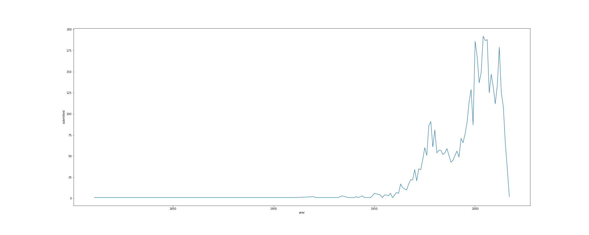
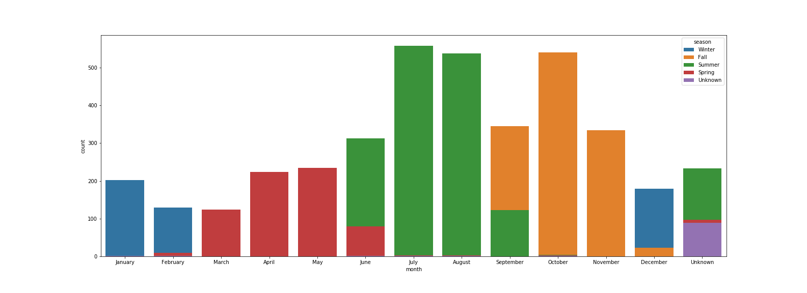

# BIGFOOT!!!

or 

????

## Loading the Data

Data was originally in a json format that contained 487 html files.  Thse files were parsed for the ID information and html text.  Beatuiful soup was used to identify the paragraph of interest which contained the title ‘field’ .  For each document in the download, the field identifiers were parsed into their own dictionaries with the keys representing the fields.  These dictionaries were then converted into a single pandas dataframe that was used for EDA.

### The Columns:
* __submitted:__ when the sighting was submitted to the website
* __title:__ title of sighting
* __year:__ year of sighting
* __season:__	season of sighting (sorta)
* __month:__ month of sighting
* __state:__ state in which sighting occurred
* __county:__ county in which sighting occurred
* __location details:__ details of where the sighting was
* __nearest town:__ nearest town to sighting
* __nearest road:__ nearest road to sighting
* __observed:__ account of what was observed
* __also noticed:__ in case they didn't finish writing what was above...maybe?
* __other witnesses:__ who else was there
* __other stories:__ inconsistent. Often it's none/nan. Sometimes it's other people who have sighted bigfoot, or other times this observer has seen bigfoot.
* __time and conditions:__ when and what was the weather like during observations
* __enviornment:__ physical description of where sighting occurred

## Exploratory Data Analysis

EDA and data exploration:
No duplicates were identified in the final data frame.  Bigfoot sightings by year (with non integer values dropped) showed that sightings started in the early 1800s and really took off in the 1970s and peaked in the early 2000s.

Sightings by month and compared to season title showed that summer and early fall were the peak seasons for Bigfoot sightings (and that many people categorize month and season differently).

Plotting data by state showed that Rhode Island had the fewest sightings and California had the most.

Conjectures based off the geographic perspective: bigfoot sighting reports are higher in states with large populations and large wooded areas

## Topic modeling

Prior to modeled, we applWe applied Clustering as well as Latent Dirichlet Allocation to the modelin order to discover hidden topics in the data. These analyses were applied over several columns including "observed" , "enviroment", "time and conditions", "other stories", and "also noticed." 

We noticed most of the results came out the same. We did not observe any more clarity from LDA vs. Clustering. Also, even though the examples below all show 5 different topics, we tried greater and fewer topics (from 2-10). Changing the number of topics did not yield any clearer results.

With the standard list of English stop words, many of the observations were the same:

_observations_ with standard English stop words:
1. night, sound, feet, tree, away, creature, got, went, left, large
2. went, got, night, looked, feet, away, sound, didn, thought, right
3. feet, got, mountain, tracks, way, camp, big, came, looked, old
4. looked, feet, went, large, night, got, creature, tall, seen, away
5. lake, forest, feet, near, night, summer, tent, kootenay, left, sasquatch

So, we augmented the standard list of English stop words with our own stop words. The result was that the latent topics still looked very similar, but with different words:

_observations_ with augmented stop words:
1. lake, feet, tracks, left, forest, mr, thought, bear, mountain, night
2. got, night, feet, away, sound, thought, didn, right, know, started
3. feet, large, got, creature, night, tall, seen, away, sound, thought
4. night, sound, tree, feet, got, camp, away, didn, left, trail
5. old, good, man, feet, got, came, water, rifle, day, way

In some cases, such as with _conditions_, we did not feel it was appropriate to remove words that showed up in many topics because these words were descriptive of what was going on (e.g. clear, night, sunny...):

Example latent clusters on _time and conditions_:
1. night, clear, moon, light, dark, 00, weather, 30, 10, late
2. clear, weather, morning, pm, sunny, 30, skies, warm, light, 00
3. day, sunny, clear, afternoon, bright, 00, pm, mid, early, summer
4. dark, clear, light, 30, weather, 00, pm, night, moon, evening
5. 30, 00, morning, pm, afternoon, early, light, sunny, 10, weather

There are similar results for _enviroment_, where clusters all sound the same:
1. ridge, campground, farm, south, land, forest, east, hill, creek, york
2. wooded, river, pine, lake, near, swamp, land, heavily, mountain, hills
3. trees, pine, river, lots, lake, forest, creek, brush, large, oak
4. forest, pine, lake, river, creek, near, dense, mountain, old, lots
5. creek, wooded, near, river, large, runs, mile, pine, old, heavily

Below is a topical list of the environment by state in which the observation occured generated by subsetting the data by state and setting the number of topics in our cluster function to 1:
1. 'Alaska': ['birch, forest, trees, hill, pine, mountains, creek, miles, located, sighting'],
2. 'Alabama': ['pine, creek, trees, wooded, river, forest, near, lake, swampy, large'],
3. 'Arkansas': ['trees, creek, pine, wooded, lake, forest, river, miles, hills, near'],
4. 'Arizona': ['forest, pine, trees, desert, ponderosa, scrub, feet, canyon, lots, oak'],
5. 'California': ['forest, pine, trees, creek, lake, river, lots, near, mountain, oak'],
6. 'Colorado': ['pine, forest, mountain, trees, aspen, feet, creek, near, rocky, elevation'],
7. 'Connecticut': ['large, areas, hills, swampy, extremely, edge, early, land, hilly, heavily'],
8. 'Delaware': ['land, forrest, forest, farm, flat, coastal, connects, country, creek, creeks'],
9. 'Florida': ['pine, swamp, forest, wooded, trees, river, near, swampy, land, areas'],
10. 'Georgia': ['pine, creek, forest, wooded, swamp, trees, mountain, creeks, near, river'],
11. 'Iowa': ['river, wooded, forest, large, near, field, creek, week, south, land'],
12. 'Idaho': ['pine, forest, lake, creek, steep, brush, miles, trees, river, near'],
13. 'Illinois': ['wooded, creek, forest, fields, trees, river, lake, near, field, oak'],
14. 'Indiana': ['forest, wooded, creek, lake, near, farm, hills, camp, hilly, river'],
15. 'Kansas': ['river, trees, mile, near, creek, field, yards, bridge, kansas, wooded'],
16. 'Kentucky': ['creek, trees, forest, wooded, large, hills, river, near, old, field'],
17. 'Louisiana': ['pine, forest, trees, swamp, creeks, hardwood, lake, bayou, swampy, dense'],
18. 'Massachusetts': ['areas, forest, wooded, pine, trees, lots, near, deer, came, maple'],
19. 'Maryland': ['trees, river, forest, ground, stream, creek, wooded, island, feet, old'],
20. 'Maine': ['trees, forest, logging, 95, wooded, populated, nearby, near, houses, various'],
21. 'Michigan': ['forest, swamp, pine, trees, wooded, lake, creek, north, pines, river'],
22. 'Minnesota': ['forest, lake, pine, near, trees, river, swamp, swamps, lakes, wooded'],
23. 'Missouri': ['creek, wooded, river, forest, trees, farm, field, hills, open, missouri'],
24. 'Mississippi': ['creek, swampy, wooded, forest, river, pine, rural, hills, stream, heavily'],
25. 'Montana': ['pine, forest, trees, creek, mountain, wooded, river, rocky, open, mountains'],
26. 'North Carolina': ['forest, pine, creek, wooded, mountain, river, mountains, near, terrain, hardwoods'],
27. 'North Dakota': ['trees, trailer, wilderness, court, minot, hills, foliage, field, dip, depressions'],
28. 'Nebraska': ['wooded, highway, ridge, pine, forest, campground, nebraska, south, trees, state'],
29. 'New Hampshire': ['house, stream, wooded, mountain, forest, creek, runs, trees, ponds, mile'],
30. 'New Jersey': ['forest, pine, wooded, trees, swamp, near, mile, lake, barrens, trail'],
31. 'New Mexico': ['pine, forest, river, oak, mountains, trees, mountain, mountainous, land, highway'],
32. 'Nevada': ['ravine, trees, streams, juniper, vegetation, context, late, feet, old, draw'],
33. 'New York': ['forest, creek, pine, trees, lake, swamp, wooded, trail, hill, mountain'],
34. 'Ohio': ['wooded, creek, forest, trees, house, river, field, lake, large, fields'],
35. 'Oklahoma': ['creek, wooded, trees, river, pine, forest, heavily, lots, near, land'],
36. 'Oregon': ['forest, trees, pine, river, fir, creek, mountain, lots, brush, lake'],
37. 'Pennsylvania': ['wooded, forest, trees, creek, pine, mountain, old, heavily, open, near'],
38. 'Rhode Island': ['maple, swamp, wetlands, great, pine, wildlife, dominated, guardrails, freshwater, forested'],
39. 'South Carolina': ['river, forest, swamp, large, land, pine, pines, areas, swampy, near'],
40. 'South Dakota': ['pine, trees, hills, rolling, forest, nearby, near, deep, limestone, mountain'],
41. 'Tennessee': ['creek, river, forest, wooded, trees, near, lots, hills, fields, heavily'],
42. 'Texas': ['wooded, river, creek, trees, pine, forest, lake, oak, land, lots'],
43. 'Utah': ['trees, pine, aspen, forest, mountain, river, brush, canyon, south, near'],
44. 'Virginia': ['forest, mountain, wooded, pine, trees, creek, open, old, mountains, national'],
45. 'Vermont': ['pine, hill, ridge, pond, wooded, grounds, information, houses, house, hemlock'],
46. 'Washington': ['forest, trees, pine, river, creek, fir, lake, old, growth, brush'],
47. 'Wisconsin': ['forest, wooded, swamp, pine, river, near, trees, lake, large, open'],
48. 'West Virginia': ['mountain, forest, creek, wooded, pine, river, large, ridge, trees, mountains'],
49. 'Wyoming': ['river, trees, forest, pine, mountain, high, creek, timber, feet, open']

Interestingly, though no one has ever captured a clear picture of Bigfoot, words like 'misty' or 'hazy' or something else connotating poor visibility do not show up as common words in any of the top words of these latent topics.

## Discussion

The fact that the latent topics all come out sounding similar may be seen as a null result for this study, or it could be looked at an analysis that all these accountings of Bigfoot are very similar to each other. Maybe too similar to each other? Either Bigfoot always appears in more or less the same way in the same conditions

Oh, and the data set was definitely about Bigfoot the Sasquatch, not Bigfoot the Monster Truck.
